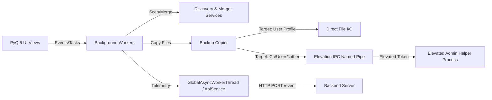

# Remos System Architecture

Remos is a Windows desktop application for discovering, merging, and restoring user backups across network shares and local storage.

## 1. Directory & Module Boundaries

- `main.py` — Entry point ([main.py:43](file:///c:/Users/100229/Documents/OC/Remos/main.py#L43)), single-instance mutex (`Global\Remos_Instance_Lock`), Qt event loop, crash hook, IPC helper server flag (`--admin-helper`).
- `config.py` — Configuration values and dataclass factories ([config.py:100](file:///c:/Users/100229/Documents/OC/Remos/config.py#L100)). Reads fallback settings from `app_secrets.py`.
- `app_secrets.py` — Sensitive credentials (`ADMIN_PASSWORD`, `BACKEND_URL`, `BACKUP_SERVER_IP`).
- `services/` — Core business logic layer:
  - `backup_discovery.py` — Scans network share `\\<ip>\Backups` and local drives for matching login/machine ID ([backup_discovery.py:15](file:///c:/Users/100229/Documents/OC/Remos/services/backup_discovery.py#L15)).
  - `admin_backup_discovery.py` — Multi-stage candidate search (`machine` -> `current_user` -> `machine_users`) with query filtering and 30s cache ([admin_backup_discovery.py:30](file:///c:/Users/100229/Documents/OC/Remos/services/admin_backup_discovery.py#L30)).
  - `backup_merger.py` — Parallel indexing via `ThreadPoolExecutor(max_workers=4)`. Resolves path conflicts across sources, keeping newest `mtime` ([backup_merger.py:40](file:///c:/Users/100229/Documents/OC/Remos/services/backup_merger.py#L40)).
  - `backup_copier.py` — Restores files concurrently, executes exponential backoff retries, filters system noise, and handles IPC elevation routing ([backup_copier.py:50](file:///c:/Users/100229/Documents/OC/Remos/services/backup_copier.py#L50)).
  - `elevation.py` — High-integrity UAC elevation IPC helper via Low-integrity SDDL Named Pipe `\\.\pipe\RemosAdminHelper` ([elevation.py:36](file:///c:/Users/100229/Documents/OC/Remos/services/elevation.py#L36)).
  - `api_service.py` — Telemetry HTTP client wrapper over `httpx.AsyncClient` ([api_service.py:28](file:///c:/Users/100229/Documents/OC/Remos/services/api_service.py#L28)).
- `ui/` — PyQt5 GUI layer:
  - `main_window.py` — View controller and stack navigator (`FadeStack`).
  - `views/` — Screen views (`welcome`, `admin`, `admin_create_backup`, `admin_restore`, `analysis`, `confirm`, `progress`, `summary`).
  - `workers.py` — Background threads (`SearchBackupsWorker`, `MergeSourcesWorker`, `CopyFilesWorker`, `GlobalAsyncWorkerThread`).

## 2. Operational Modes & Elevation IPC

1. **Normal User Mode**: Restores files into current user's profile without admin elevation.
2. **Admin Mode**: Enabled via credentials check. Allows searching any machine/user profile.
   - When copying into foreign profile paths (`C:\Users\<other>`), write access requires High-integrity token.
   - Spawns elevated helper process `main.py --admin-helper` via UAC `ShellExecute(..., "runas")`.
   - Helper listens on Named Pipe `\\.\pipe\RemosAdminHelper` with explicit SDDL `D:(A;;GA;;;WD)S:(ML;;;;;LW)` allowing Medium-integrity client connections ([elevation.py:55](file:///c:/Users/100229/Documents/OC/Remos/services/elevation.py#L55)).
   - Client reuses single persistent pipe handle with `_client_lock` serialization to eliminate IPC reconnect overhead ([elevation.py:65](file:///c:/Users/100229/Documents/OC/Remos/services/elevation.py#L65)).

## 3. Telemetry Event Stream

Telemetry events (`APP_STARTUP`, `RESTORE_SUCCESS`, `RESTORE_FAILURE`, `APP_CRASH`) are sent to `BACKEND_URL/event` via `ApiService`. All calls are non-blocking and fire-and-forget. Crashes trigger stack trace capture via `sys.excepthook` ([main.py:105](file:///c:/Users/100229/Documents/OC/Remos/main.py#L105)).

